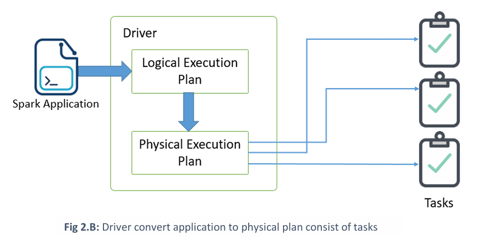
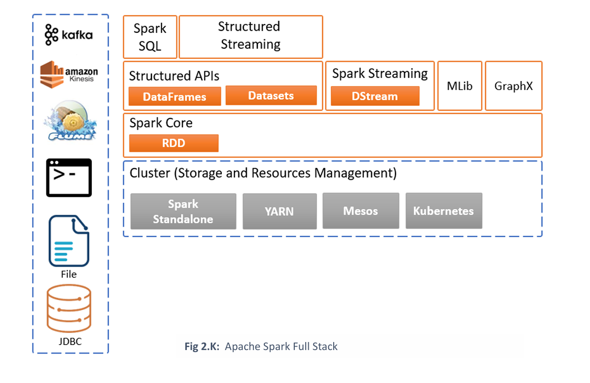
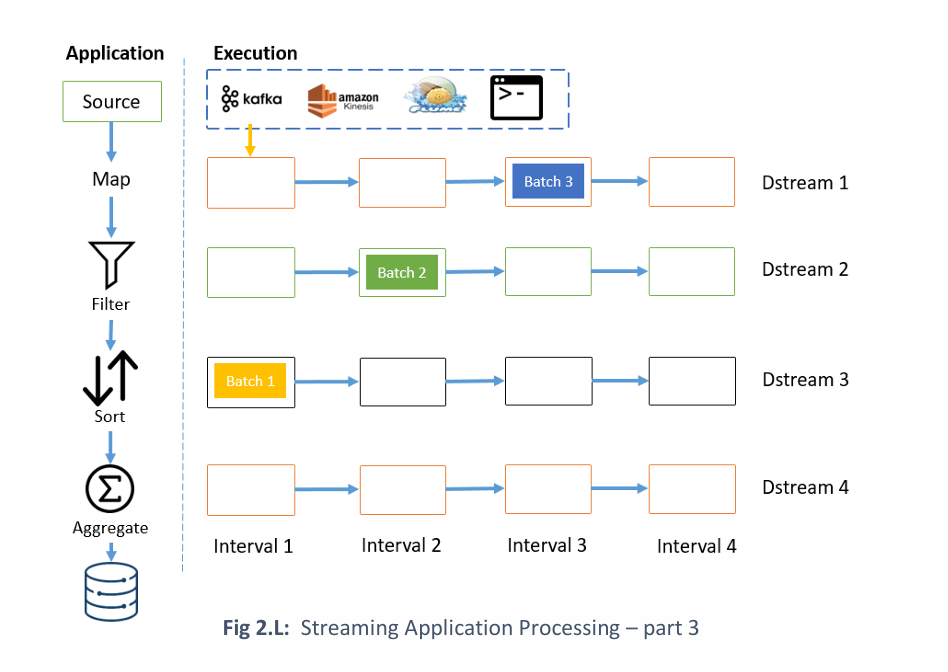
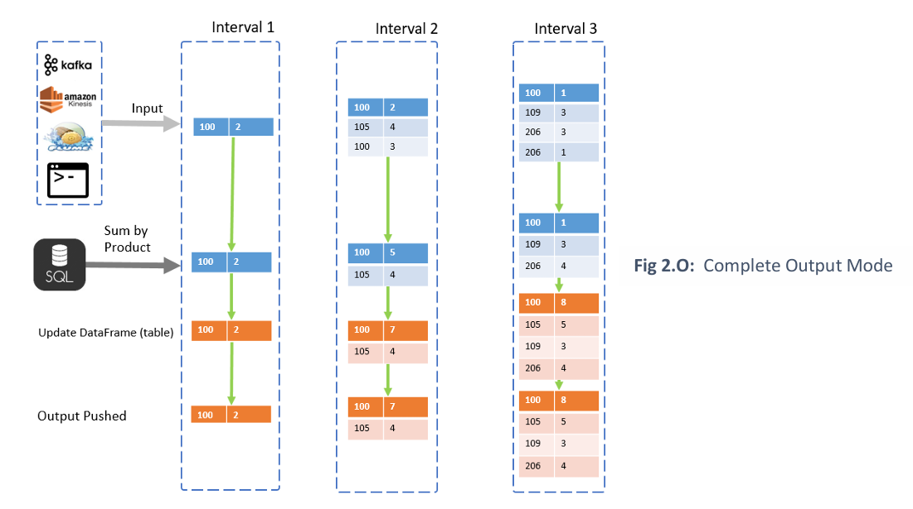
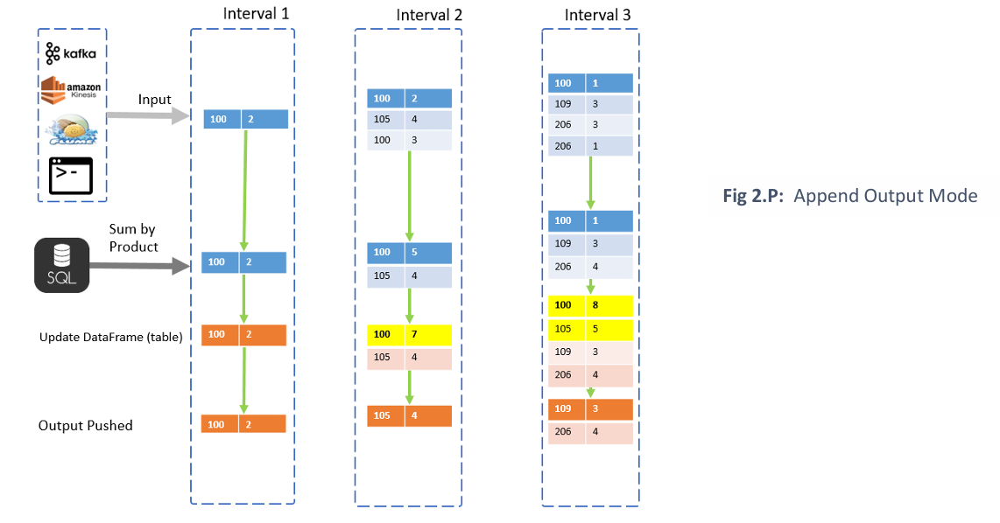
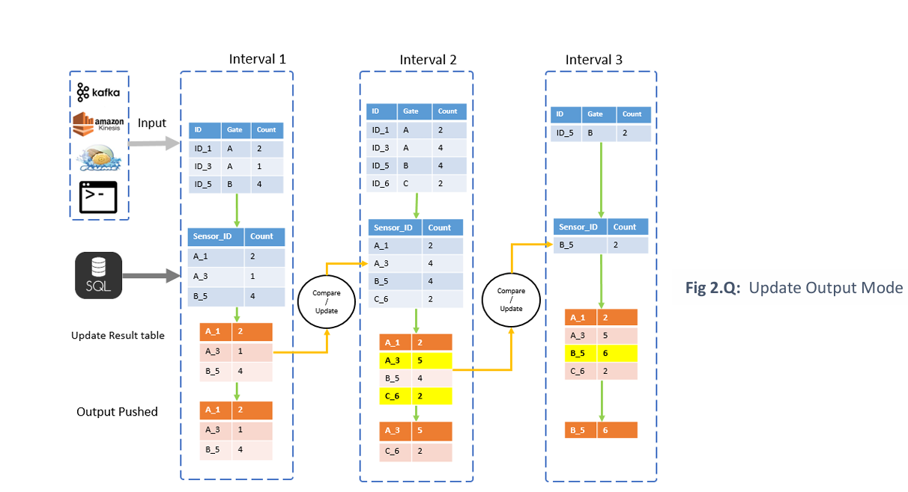

# Chapter 1: Let’s Dive into Spark

## Overview

In this chapter, we explore the **core components of Apache Spark** to understand what happens behind the scenes when executing a Spark application. Instead of just explaining each part, this book takes a hands-on approach—illustrating how each component works using examples.

---

## Apache Spark Architecture


Apache Spark operates in a **clustered environment** that includes two main parts:

- **Cluster Side**: This includes the **Worker Nodes** and the **Cluster Manager**, which is responsible for:
  - Managing and scheduling resources  
  - Monitoring application execution  
  - Allocating computing resources

> The Cluster Manager can vary depending on the deployment mode—**YARN**, **Mesos**, **Spark Standalone**, or **Kubernetes**. For example, in a YARN cluster, the **Resource Manager** acts as the Cluster Manager.

---

## Executors

When a Spark application is submitted, it is broken down into smaller **tasks** that run on **Executors**. These are **JVM processes** launched on Worker Nodes.

- Each Spark application has its own set of executors.  
- Multiple executors can run on the same Worker Node—whether for the same or different applications.  
- Executors live throughout the lifecycle of the application (start to finish).  
- The Cluster Manager is responsible for launching executors and handling failures by restarting them when needed.

---

## Spark Driver

The **Driver** is the central component of a Spark application. It handles:

1. **Converting the user application** into a **physical execution plan**, breaking it into tasks for executors to run.  
2. **Communicating with the Cluster Manager** to request resources and manage executors.  
3. **Monitoring executors**, collecting results, and returning them to the user.

> The Driver is where the Spark application starts and ends. A simplified flow of this process is shown in Figure 2.B in the book.



---

## SparkSession

The **SparkSession** is the **main entry point** for interacting with Spark.

- It is created by the **Driver** at the start of the application and remains active throughout the lifecycle.  
- It serves as the bridge between the application and the cluster.  
- It allows configuration of key settings such as:
  - Application name  
  - Execution mode (local, YARN, Mesos, Standalone, or Kubernetes)  
  - Number of executors and cores  

> Since **Spark 2.0**, SparkSession **unifies all Spark contexts**, replacing the need to separately create `SparkContext`, `SQLContext`, or `HiveContext`. It simplifies development by providing a single access point for all Spark functionality.


## RDD (Resilient Distributed Datasets)

**RDD** is the foundational data structure and processing unit in Spark applications. Every Spark application operates on a series of RDDs, which represent distributed collections of data.

### What does "Resilient" mean?

- Spark maintains a **data lineage**, which means that if any RDD is lost due to failure, Spark can **recompute** it using the original source and the sequence of transformations applied.
- RDDs can be created from various sources such as:
  - Files (e.g., CSV, JSON, Parquet)
  - Other RDDs
  - Arrays
  - Database tables

> **Example:**  
If `RDD1` is created from a file and a transformation results in `RDD2`, Spark can regenerate `RDD2` from `RDD1` if there's a failure.

### DAG: The Backbone of Data Lineage

This lineage is represented as a **DAG (Directed Acyclic Graph)**, which outlines the complete execution path—from data source to final result—used by Spark to optimize and recover computations.

---

## Why "Distributed"?

RDD data is **partitioned** into chunks and spread across **multiple worker nodes** in the cluster. This distribution enables parallel processing and scalability.

- Developers have control over:
  - The number of partitions
  - How data is partitioned across nodes

> More details on this are discussed in the section: _Partition Output_.

---

## RDD Properties

### 1. Immutable

RDDs are **immutable**—once created, their content cannot be changed. Any transformation on an RDD results in the creation of a **new RDD**.

> **Example:**  
Reading a file into `RDD1`, then applying a `filter` operation produces `RDD2`. `RDD1` remains unchanged and reusable.

---

### 2. In-Memory Storage

- RDDs are designed for **in-memory processing** for fast computation.
- Intermediate results are also stored in memory.
- If memory is insufficient, Spark spills data to **disk**, which may degrade performance.

---

### 3. Persistence

By default, RDDs are recomputed when needed, but they can be **persisted** in memory or on disk to avoid re-computation.

> **Example:**  
Consider a Spark job that:
1. Reads from a file → creates `RDD1`
2. Applies filtering → produces `RDD2`
3. Sorts data → produces `RDD3`
4. Joins `RDD3` with `RDD4` (from a database)
5. Performs aggregations on the result

If `RDD3` is **persisted**, it avoids re-executing steps 1–3 on subsequent runs. The application can directly use the stored `RDD3` for further operations like joining and aggregation.

---

## RDD Operations

RDDs support two main types of operations:

- **Transformations** – define the processing logic  
- **Actions** – trigger execution and return results

---

### Transformations

Transformations are operations that take an RDD as input and return a new RDD. They define **how data is processed**, but do **not** trigger execution immediately.

There are two types of transformations:

#### 1. Narrow Transformations

Narrow transformations are those where the data required to compute the records in a partition **reside in the same partition** of the parent RDD. No data shuffling is required.

**Examples:** `map()`, `filter()`

> **Example Use Case:**  
Given an RDD of employee records in CSV format:  
`Employee ID, First Name, Last Name, Age`  
- Use `map()` to combine First Name and Last Name into a full name field  
- Use `filter()` to exclude employees aged 30 or older  

These operations are applied within the same partition and result in a new RDD without moving data between nodes — a **narrow transformation**.

#### 2. Wide Transformations

Wide transformations require **data to be shuffled** across partitions and cluster nodes to compute the result. This typically happens when data must be grouped or sorted by key.

**Example:** `groupByKey()`

> **Example Use Case:**  
Group employees by their `department_id` (last field in the CSV). This requires Spark to move data across partitions so all records with the same department ID end up together.

---

### ⚠️ Performance Note

- Wide transformations involve **network communication** between cluster nodes.  
- This increases application latency, especially when **large datasets** are shuffled.  
- Performance is influenced by the **network bandwidth** between worker nodes.

---

### Actions

Actions are operations that **trigger execution** and return non-RDD results—either to the **driver**, **external systems**, or **in-memory variables**.

**Common Actions:**
- `collect()`
- `count()`
- `take(n)`

Actions are what actually start Spark jobs. Until an action is called, Spark **does not perform any computation**.

---

### Lazy Evaluation

Spark uses **lazy evaluation**. This means:

- Transformations are **not executed immediately**  
- Spark **builds a DAG (Directed Acyclic Graph)** of transformations  
- Execution only starts when an **action** is triggered

> **Example:**
```python
rdd = sc.parallelize(range(1, 1001))
squared_rdd = rdd.map(lambda x: x ** 2)
sample = squared_rdd.take(10)
```
In this example:

- No data is loaded or processed until `.take(10)` is called.  
- The transformations (`map`) are only *planned*, not executed.

---

### Lazy Evaluation Benefits

Lazy evaluation allows Spark to **optimize the entire pipeline** before execution.

> **Example Use Case:**
- Read 100K records from a database table  
- Apply `map()`  
- Sort the RDD → causes shuffle  
- Group by key → causes shuffle  
- Apply `filter()` → reduces data to 30K records  
- Call `.count()` → triggers execution

With lazy evaluation, Spark **waits until the `.count()` action** before starting execution.  
This allows it to optimize the query plan and **minimize the amount of data processed and shuffled** across stages.


## Spark API Stack



Apache Spark is a **unified data processing platform** that supports various workloads:

- **Batch processing**
- **Streaming**
- **Machine Learning**
- **Graph Analytics**

You can build applications for each of these domains and **integrate them seamlessly**—without added architectural complexity.

Spark runs on multiple **cluster managers**:
- YARN
- Mesos
- Spark Standalone
- Kubernetes

It also supports various **data sources**:
- **Batch sources:** Parquet, Avro, JSON, ORC, JDBC, and more
- **Streaming sources:** Kafka, Kinesis, Flume, HDFS

The following sections provide a brief overview of Spark’s main APIs (detailed examples come later in the book).

---

## Spark Core API (Lower-Level API)

Apache Spark offers two API levels:

- **Lower-Level API:** Based on **RDDs**
- **Higher-Level API:** Known as **Structured APIs** (e.g., DataFrames & Datasets)

### Why Use RDD?

RDD is the **foundational API** in Spark. All other APIs are built on top of it. You can use RDDs to build batch and streaming applications.

Use RDDs when:

1. **You need full control** over data processing:
   - You can write detailed lambda functions to manipulate the data
   - However, you must manually define schema (column names and types)

2. **You are working with unstructured data**:
   - Example: processing images, audio, or video that doesn’t fit a tabular format

3. **You want fine-grained control over execution**:
   - This includes how transformations and actions are defined and executed

### Drawbacks of RDDs:

- Spark **can’t optimize** your code since it doesn’t know your end goal
- You’re fully responsible for **performance tuning**
- Code complexity increases significantly
- Lack of schema inference makes structured data harder to manage

> 🔍 **Conclusion:** RDDs offer maximum flexibility but lack built-in optimization. They're best used in **special cases**, like unstructured data processing.

---

## Structured APIs (DataFrames and Datasets)

Structured APIs process data as **immutable, distributed collections of columns**, similar to tables in relational databases. This format makes them:

- Easy to use
- Familiar to SQL developers, data engineers, data scientists, and business analysts

### Benefits of Structured APIs:

- Schema inference
- Optimized execution using **Catalyst optimizer**
- Easier integration with BI tools and SQL-based workflows

Structured API includes two main types:

1. **DataFrames**
   - Untyped API
   - Alias for `Dataset[Row]` (a generic row structure)

2. **Datasets**
   - Strongly-typed API
   - Allows compile-time type safety (available in Scala/Java only)

> ✅ **Note:** Since **Spark 2.0**, both DataFrames and Datasets are unified under a single API. We’ll explore them in detail in the next chapter.


## Spark Streaming

**Spark Streaming** is an extension of the Spark Core API that enables real-time processing of data streams. It supports ingestion from sources such as:

- Kafka
- Kinesis
- Flume
- Network sockets

You can apply a variety of processing tasks on streaming data, including:

- Machine learning
- On-the-fly and incremental aggregations
- Data transformation
- Integration with other Spark apps or external systems

---

### How Spark Streaming Works

Spark Streaming splits incoming data into **micro-batches** based on a configured time interval. Each batch is then processed independently and in parallel.

> **Example:**  
If you configure a 3-second interval, Spark will process one micro-batch (an RDD) every 3 seconds.

In a batch job, a transformation like `map()` results in a single RDD. In streaming, the same operation results in a **sequence of RDDs**, one for each micro-batch.

This sequence is abstracted as a **DStream (Discretized Stream)** — a high-level abstraction representing a continuous stream of data as a series of RDDs.

---


### Parallel Execution with DStreams

Each batch flows through the same DAG (set of operations):

- `Batch 1` enters operation 1 (e.g., `map`)
- Simultaneously, `Batch 2` enters the pipeline at operation 1
- Meanwhile, `Batch 1` moves to operation 2 (e.g., `filter`), and so on

> This parallelism allows continuous stream processing without delay.

---

## Structured Streaming

**Structured Streaming** is a modern approach built on top of Spark SQL and Structured APIs (DataFrames & Datasets). It treats incoming data as **a continuously growing table**.

A **Spark SQL query** is applied on top of this unbounded table, and the results are written to external systems like:

- S3
- HDFS
- Databases
- Dashboards

---

### Development Workflow

The typical flow of a Structured Streaming application involves:

1. **Define input source** (e.g., Kafka, Kinesis, Flume, or socket)
2. **Write a batch query** using DataFrame/Dataset API or Spark SQL
3. **Set a trigger** to control when to process new data
4. **Select an output mode** to define what data gets pushed after each trigger

> Think of it like a DataFrame that continuously receives new records and applies a query on them.

---

### Example Use Case

Retail store sales streaming every 3 seconds:

- Stream includes: `(Product ID, Quantity Sold)`
- Spark performs real-time aggregation by product ID
- Note: Spark **does not store** source data. It reads, computes, and discards

---

## Output Modes in Structured Streaming

There are three output modes, depending on the application needs:

### 1. Complete Mode

- Pushes the **entire updated result table** after every trigger
- Suitable for aggregations where full results are expected each time



> 💡 Example: Push complete aggregated sales table to dashboard every 3 seconds

---

### 2. Append Mode

- Only **new rows** added since the last trigger are sent to output
- Suitable when data **does not change** after it is added



> ⚠️ Not suitable for aggregation unless using **watermarking** to discard old state

> ❌ Without watermark:
  - Aggregated values may update (e.g., product 100 sales), but won't be pushed
  - Results in incorrect or missing updates

> ✅ Suitable for transformations like `map()` or `flatMap()` where rows are independent

---

### 3. Update Mode

- Only **updated rows** since the last trigger are pushed
- Best for stateful applications like IoT systems




> **Example:**  
IoT sensors stream data in format `(sensor ID, count)`  
Spark keeps a state per sensor and compares the count after each trigger  
Only **updated sensors** are pushed to the external system


---


