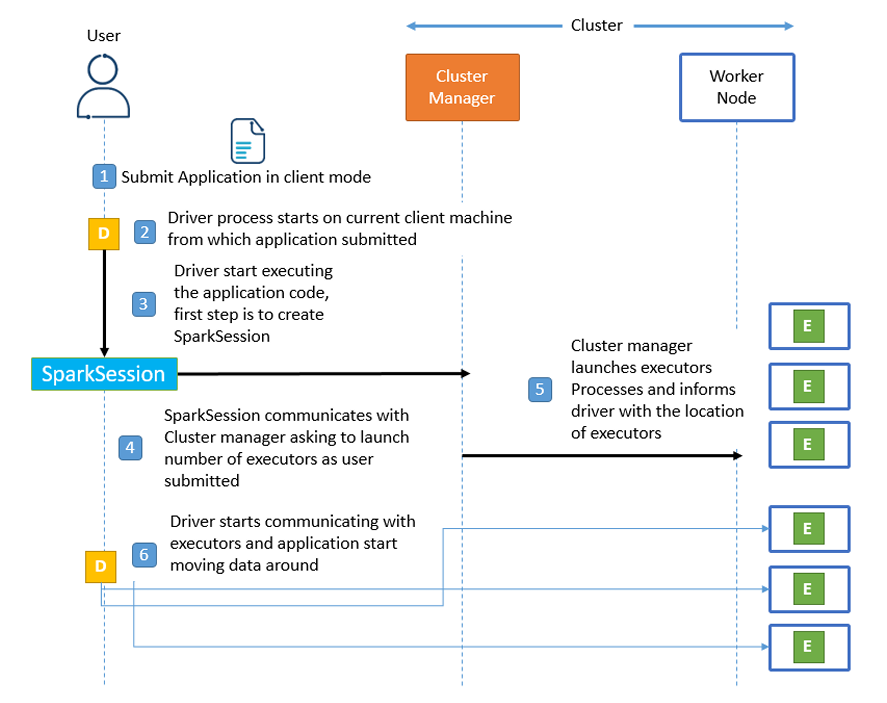
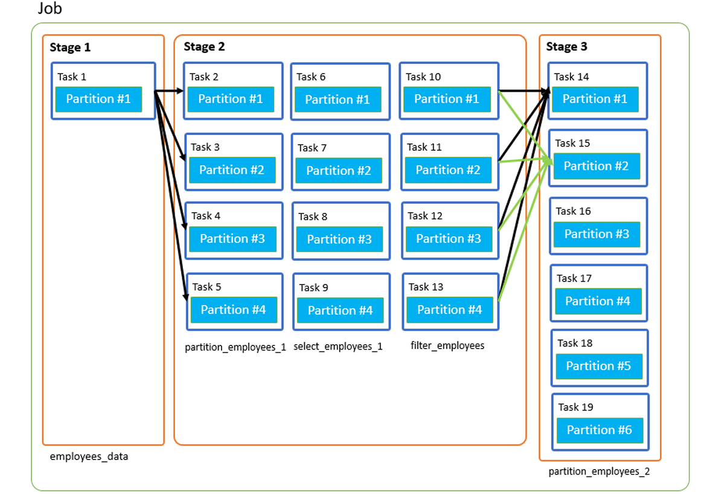

# Chapter 2: Spark Under the Hood

## Apache Spark Execution Modes

After exploring the core components of Spark and understanding RDD behavior, we now look into how **Spark applications are executed in different modes**.

Each execution mode differs in:

- **Resource allocation**
- **Driver & Executor placement**

---

## Cluster Mode

In **Cluster Mode**, the user submits a **packaged Spark application** to the **cluster manager**, which then takes over and manages the full execution lifecycle.

The **driver** and **executors** are launched on the cluster, and the application is managed independently from the user's machine.


### 🔁 Execution Flow in Cluster Mode:

1. **Submit the application**  
   The user packages the Spark application and submits it using `spark-submit`.

2. **Cluster manager launches the Driver**  
   The driver process is launched on one of the **worker nodes** by the cluster manager.

3. **Driver starts application**  
   The driver initiates the application by creating a `SparkSession`, which serves as the entry point.

4. **Driver requests resources**  
   The `SparkSession` communicates with the cluster manager to request executors.

5. **Executors are launched**  
   The cluster manager launches executors as requested and sends their locations back to the driver.

6. **Driver communicates with Executors**  
   The driver sends tasks to executors, coordinates execution, and manages data flow.

> 🔹 Even if the client machine disconnects, the application **continues running** because all components are managed inside the cluster.

---

In the next sections, we’ll explore other execution modes like **Client Mode**, **Local Mode**, and how to package and deploy applications with `spark-submit`.


## Client Mode

In **Client Mode**, the **driver process runs on the local machine** (the machine used to submit the application), while the **executors run on the cluster**.

Unlike Cluster Mode, where everything is managed remotely inside the cluster, in Client Mode, the submitting machine (your laptop or a gateway node) is responsible for managing the driver.




---

### 🔁 Execution Flow in Client Mode:

1. **Submit the application**  
   The user submits a packaged application using `spark-submit --deploy-mode client`.

2. **Driver starts locally**  
   The driver process is launched on the same machine from which the application is submitted.

3. **Driver starts SparkSession**  
   The driver initializes the `SparkSession`, which acts as the entry point for the application.

4. **Driver requests resources**  
   `SparkSession` contacts the cluster manager to request executors based on submitted configurations.

5. **Executors are launched**  
   The cluster manager launches executors on available **worker nodes**, then informs the driver of their locations.

6. **Driver communicates with Executors**  
   The driver sends tasks to executors and coordinates data movement and computation.

---

### 🆚 Cluster Mode vs Client Mode

| Feature              | Cluster Mode                           | Client Mode                             |
|---------------------|----------------------------------------|------------------------------------------|
| Driver Location      | Inside cluster (on a worker node)      | Local machine (user’s device/gateway)    |
| Network Dependency   | Less dependent                         | Highly dependent on network stability    |
| Fault Tolerance      | High (client can disconnect safely)    | Low (if client disconnects, app fails)   |
| Use Case             | Production / Scheduled jobs            | Development / Interactive analysis       |

---

### ⚠️ Performance Note

In **Client Mode**, the **network connection between the local machine and the cluster** plays a critical role:

- **High latency** or **network drops** can cause the entire job to fail  
- It’s **not recommended for production** unless the client machine is stable and close to the cluster (e.g., a secure edge node)

> ✅ **Use Case Example:**  
You're developing a Spark job on your laptop connected to a test cluster. You want to interactively test logic before deploying to production. Client mode is ideal here.

---

## Local Mode

**Local Mode** runs **everything (driver and executors) on a single machine**, without using any cluster manager.

This is ideal for:

- Development
- Testing
- Learning Spark on a local environment

### Key Characteristics:

- All processes run as **threads** within the same JVM
- No network or cluster setup required
- Uses `spark-submit --master local[*]` or runs in Databricks notebooks by default

> ✅ **Example:**  
You're writing and debugging a Spark job on your laptop with no cluster access. Use Local Mode to run everything on your machine without needing a remote Spark cluster.

---

### Summary

| Execution Mode | Driver Location     | Executors Location       | Use Case                  |
|----------------|---------------------|---------------------------|---------------------------|
| Cluster        | Cluster Worker Node | Cluster Worker Nodes      | Production jobs           |
| Client         | Local Machine       | Cluster Worker Nodes      | Development, quick testing|
| Local          | Local Machine       | Local Threads (JVM)       | Debugging, tutorials      |


---


## Jobs, Stages, and Tasks in Spark

Spark breaks down the execution of a program into three logical levels:

- **Job**
- **Stage**
- **Task**

---

### 🔹 What is a Task?

A **Task** is the smallest unit of work in Spark.  
Each **partition** of an RDD, DataFrame, or Dataset corresponds to **one task**.

> 💡 Example:  
If your RDD has **50 partitions**, Spark creates **50 tasks** to process it — one per partition.

---

### 🔹 What is a Stage?

A **Stage** is a group of tasks that can be executed **together** without requiring a data shuffle.

A new Stage is created when:

- A **shuffle** is required (e.g., `repartition`, `join`, `groupBy`)
- Data needs to be **moved across partitions or nodes**

When no shuffling is needed, Spark uses **pipelining** to combine multiple operations in the same stage.

---

### 🔹 What is a Job?

A **Job** is triggered by an **action** like `.count()`, `.collect()`, or `.save()`.  
Each action in your Spark code starts a new **job**.

---

### 🧪 Example

```scala
val employees_data = spark.read
  .format("csv")
  .option("Header", "True")
  .schema(employees_schema)
  .load("/src/main/resources/Employee_Data.csv")
  .toDF()

val partition_employees_1 = employees_data.repartition(4)

val select_employees_1 = partition_employees_1.select("NAME", "JOB_TITLE", "DEPARTEMENT")

val filter_employees = select_employees_1.filter(expr("DEPARTEMENT == 'FIRE'"))

val partition_employees_2 = filter_employees.repartition(6)

partition_employees_2.count()
```



---

### 🔁 Execution Breakdown

This code triggers **one action**: `.count()` → **1 Job**

Now let’s break down the **Stages and Tasks**:

#### **Stage 1**
- **Operation:** Read from CSV
- **Partitions:** 1
- **Tasks:** 1

#### **Stage 2**
- **Operation:** `repartition(4)` causes a **shuffle**  
- **New Stage:** Created due to shuffle
- **Tasks:** 4 (one per new partition)
- **Pipelined Operations:**  
  - `select("NAME", "JOB_TITLE", "DEPARTEMENT")`  
  - `filter(DEPARTEMENT == 'FIRE')`  
  These are transformations **within the same partition**, so they are **pipelined** into Stage 2.

#### **Stage 3**
- **Operation:** `repartition(6)` → another **shuffle**
- **New Stage:** Created due to shuffle
- **Tasks:** 6
- `.count()` is the **action**, and it's executed over these 6 partitions → 6 tasks


---

### 🔍 Summary Rules

| Concept      | Depends On                   |
|--------------|------------------------------|
| **Jobs**     | Number of **actions**        |
| **Stages**   | Number of **shuffles**       |
| **Tasks**    | Number of **partitions**     |

> 📌 **Note**  
> - A **new job** is triggered for each **action** (e.g., `count()`, `collect()`, `save()`)  
> - A **new stage** is created whenever a **shuffle** is required (e.g., `repartition`, `join`, `groupBy`)  
> - The **number of tasks** in a stage is determined by the **number of partitions** being processed in that stage
