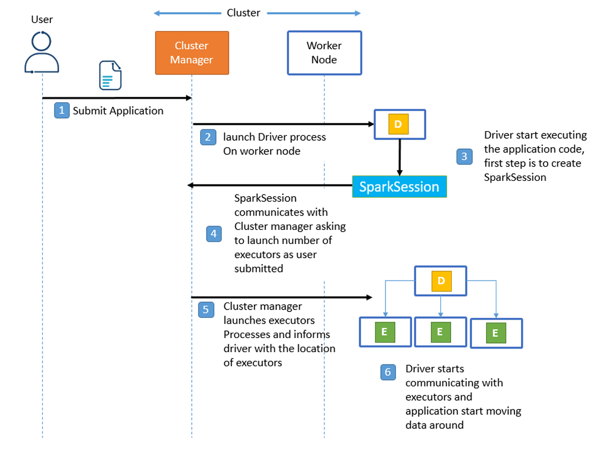

# Chapter 2: Spark Under the Hood

## Apache Spark Execution Modes

After exploring the core components of Spark and understanding RDD behavior, we now look into how **Spark applications are executed in different modes**.

Each execution mode differs in:

- **Resource allocation**
- **Driver & Executor placement**

---

## Cluster Mode

In **Cluster Mode**, the user submits a **packaged Spark application** to the **cluster manager**, which then takes over and manages the full execution lifecycle.

The **driver** and **executors** are launched on the cluster, and the application is managed independently from the user's machine.

### 🔁 Execution Flow in Cluster Mode:

1. **Submit the application**  
   The user packages the Spark application and submits it using `spark-submit`.

2. **Cluster manager launches the Driver**  
   The driver process is launched on one of the **worker nodes** by the cluster manager.

3. **Driver starts application**  
   The driver initiates the application by creating a `SparkSession`, which serves as the entry point.

4. **Driver requests resources**  
   The `SparkSession` communicates with the cluster manager to request executors.

5. **Executors are launched**  
   The cluster manager launches executors as requested and sends their locations back to the driver.

6. **Driver communicates with Executors**  
   The driver sends tasks to executors, coordinates execution, and manages data flow.

> 🔹 Even if the client machine disconnects, the application **continues running** because all components are managed inside the cluster.

---

In the next sections, we’ll explore other execution modes like **Client Mode**, **Local Mode**, and how to package and deploy applications with `spark-submit`.

