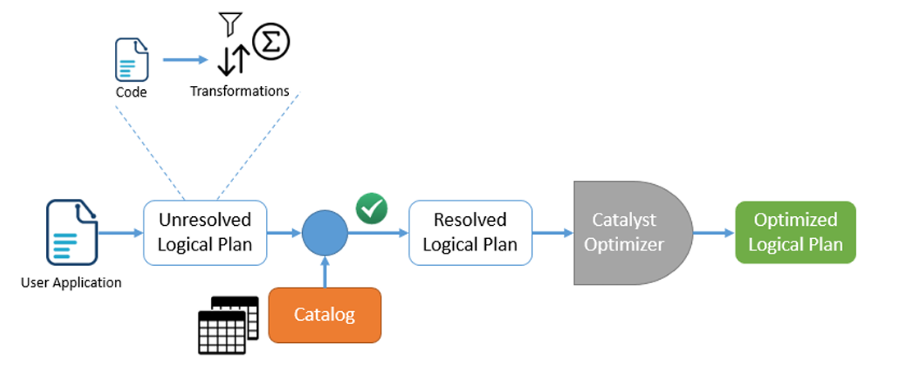
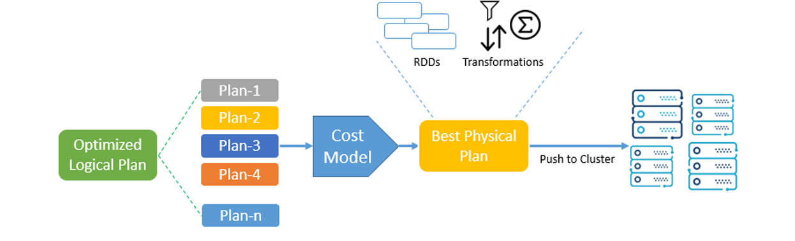

# Chapter 3: Spark Structured APIs
> 📓 👉 All code examples for the DataFrame Operations section can be found in the notebook included in this repo: [`CH3_code_demo.ipynb`](chapters/Notebooks/Ch3_code_demo.ipynb)
## What Are Structured APIs?

Spark’s **Structured APIs** allow you to process data as **immutable distributed collections** in the form of **columns and rows**, similar to a **relational database table**.

This structure makes it accessible to:

- Data engineers  
- Data scientists  
- Business analysts  
- SQL developers  

---

## 🔍 Why Structured Format Matters?

1. **Ease of Use**  
   Structured data allows users familiar with SQL or tabular formats to work in Spark without needing to learn low-level APIs.

2. **Performance Optimization**  
   With structured input, Spark knows:
   - The **schema** (column names and data types)
   - The **operation** (e.g., join, filter, groupBy)

   This visibility allows Spark to perform **query planning and optimization** before execution.

   > 🔸 In contrast:  
   > When using low-level RDD APIs, Spark lacks schema context and treats operations as black boxes, so **no optimization** can be applied.

---

## 🔄 DataFrame vs Dataset

| Feature        | **DataFrame**                       | **Dataset**                          |
|----------------|--------------------------------------|--------------------------------------|
| Typing         | Untyped (internally uses `Row`)      | Strongly typed (uses JVM types)      |
| Language       | All supported languages              | Scala and Java only                  |
| Performance    | Optimized using Catalyst             | Same as DataFrame + type safety      |
| Alias          | `Dataset[Row]`                       | `Dataset[T]`, where `T` is a class    |

- Starting from **Spark 2.0**, both APIs are part of the same unified **Structured API**.
- You can use **API functions** or **SQL syntax** to work with either DataFrames or Datasets.

---

## ⚙️ Spark Execution Pipeline (Behind the Scenes)


Whenever a DataFrame, Dataset, or SQL query is submitted to Spark, it goes through multiple planning and optimization phases:

### 1. **Unresolved Logical Plan**
- Spark parses your code and builds an **initial abstract plan** (transformations & operations)
- No validation is done yet (e.g., column names or tables aren’t checked)

### 2. **Catalog Validation**
- Spark validates the logical plan against the **Catalog** (the internal store of metadata for tables/DataFrames)
- If columns and schema match, Spark generates a **Resolved Logical Plan**

### 3. **Catalyst Optimizer**
- Spark applies **logical optimizations** (e.g., predicate pushdown, constant folding)
- Produces an **optimized logical plan**

### 4. **Physical Planning**



- Spark generates multiple **physical plans** that describe how to execute the operations
- A **cost-based model** is used to choose the most efficient one
- Final result is a **Physical Plan** → broken down into **RDDs** and **transformations**

> 🧠 This layered planning system is what makes Structured APIs in Spark both **powerful** and **performant**.

---

## 🛠 What’s Next?

Now that we understand how Spark translates Structured API code into an executable plan, in the next sections we’ll dive deeper into:

- **DataFrames**
- **Datasets**
- **Common transformations and actions**
- **SQL syntax with Spark**

---

## 📘 DataFrames in Spark Structured API

A **DataFrame** is a core part of the Structured API and is built on top of the **RDD API**, so it inherits:

- ✅ **Immutability**: You can’t modify a DataFrame directly — any transformation (e.g., `filter`, `select`) creates a **new DataFrame**.
- ✅ **Lazy Evaluation**: Transformations are not executed immediately. Spark **waits** until an **action** (e.g., `count()`, `show()`, `collect()`) is called before actually performing computations.

---

### 🧩 What is a DataFrame?

A **DataFrame** is a **distributed table** with:
- **Columns** (each with a name and a data type)
- **Rows** (records)

This structure is very similar to a table in a **relational database**.

---

### 🧾 Schema

The **schema** of a DataFrame defines:
- 📌 **Column Name**
- 📌 **Data Type**

> Example schema:
```text
| Name      | Type    |
|-----------|---------|
| id        | Integer |
| name      | String  |
| salary    | Double  |

```

Schemas allow Spark to:

- ✅ Understand the structure of the data
- 🚀 Apply optimizations at query time
- 🛡️ Validate queries during execution planning

---

# 📂 Partitioning in Spark Structured API

As discussed earlier in the RDD section, a **DataFrame or Dataset** is essentially built on top of RDDs, which means it's **distributed by nature**. Each RDD is broken into **partitions**, and these partitions are distributed across different worker nodes in the cluster.

When a DataFrame operation is executed, each **executor** works independently on its assigned partition. This section explores **how partitioning works**, **how to control it**, and **why it matters**.

---

## ❓ Why Partitioning Matters

Partitioning can significantly enhance performance — especially in operations like **joins** and **aggregations**.

- 🔁 If data is partitioned by the **join key**, all values related to that key will reside on the same node → reducing **shuffles** and **network traffic**.
- 🚫 If no joins or grouping operations are performed, partitioning might not help — and can **hurt performance** if misused.

---

## ⚖️ Too Few vs Too Many Partitions

- **Too few partitions** → low concurrency, poor resource utilization.
- **Too many partitions** → overhead, longer execution times.

> 🧠 Best practice: The ideal number of partitions depends on:
> - Number of **CPU cores** across the cluster.
> - The application’s **business logic**.

---

## 🗝️ Guidelines for Choosing Partition Keys

1. Use columns that are **frequently involved in joins**.
2. ❌ Avoid **skewed columns** — where one or two values dominate the dataset.

---

## 🔍 Get Number of Partitions

```python
print("Number of Partitions:", df.rdd.getNumPartitions())
```

Alternate method:

```python
print("Partitions Size:", len(df.rdd.partitions))
```

---

## 🏗️ Setting Partitions During Read

You can specify the number of partitions **while reading** data:

```python
df = spark.read.csv("/path/to/file.csv", header=True, schema=schema) \
    .repartition(10)
```

- Spark distributes data across **10 partitions** using **hash partitioning**.

---

## 🧩 Partition by Column(s)

You can partition based on a **column** or **multiple columns**:

```python
df = spark.read.csv("/path/to/file.csv", header=True, schema=schema) \
    .repartition("DEPARTEMENT")
```

🧠 Note:
- Spark uses **200** partitions by default (`spark.sql.shuffle.partitions`)
- If your column has **37 distinct values**, only 37 will have data — **163 will be empty**

---

## ⚙️ Change Default Shuffle Partitions

Update the config in `SparkSession`:

```python
spark = SparkSession.builder \
    .appName("MyApp") \
    .config("spark.sql.shuffle.partitions", "150") \
    .getOrCreate()
```

---

## 🔀 Partition by Column + Set Number of Partitions

You can also partition by a column and control the number of partitions:

```python
df = df.repartition(15, col("DEPARTEMENT"))
```

Spark computes:
```
partition = hash(partition_key) % number_of_partitions
```

---

## 🔁 Repartition an Existing DataFrame

```python
df_partitioned = df.repartition(15, col("DEPARTEMENT"))

print("Original Partitions:", df.rdd.getNumPartitions())
print("New Partitions:", df_partitioned.rdd.getNumPartitions())
```

---

## 💾 Cache or Persist Partitioned Data

If you plan to reuse the partitioned DataFrame:

```python
df_partitioned.cache()
# or
df_partitioned.persist()
```

---

## 📝 Important Notes

| Concept    | Description                            |
|------------|----------------------------------------|
| Jobs       | Determined by number of actions        |
| Stages     | Determined by number of shuffles       |
| Tasks      | Determined by number of partitions     |

> ✅ Spark will generate partitions equal to the value of `spark.sql.shuffle.partitions` when partitioning by column(s).
>
> If your DataFrame has **fewer distinct values**, the rest of the partitions will be **empty**.

---

## ✅ Summary

- Partitioning improves performance in joins and aggregations.
- Set partitions smartly — avoid skew and unnecessary overhead.
- Monitor and tune partition count based on the cluster and workload.

